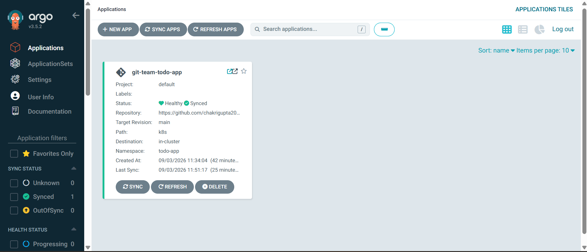
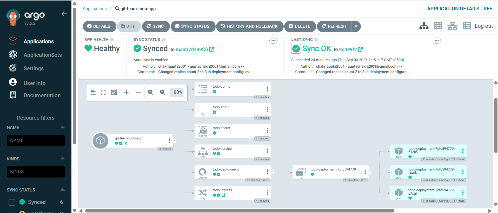
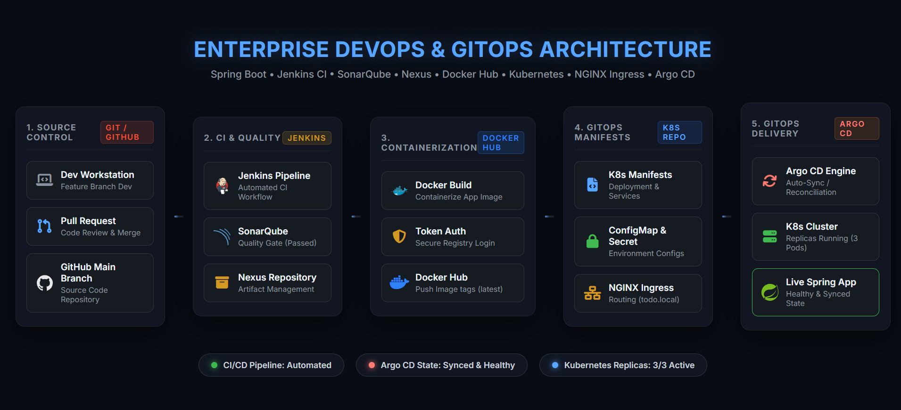

# Git Team Todo App

A DevOps and Git collaboration project demonstrating **Git/GitHub collaboration, CI/CD automation, containerization, Kubernetes deployment, and GitOps using Argo CD**.

The project started as a collaborative Git practice project and was progressively extended into a complete DevOps workflow.

---

## 🚀 Project Overview

The Git Team Todo App is a Spring Boot application deployed using modern DevOps practices.

The project demonstrates:

* Git and GitHub collaboration
* Feature branches and Pull Requests
* Maven build automation
* Jenkins CI pipeline
* SonarQube code quality analysis
* Nexus artifact repository
* Docker containerization
* Kubernetes deployment
* Kubernetes ConfigMap and Secret management
* Kubernetes Service and Ingress
* Health checks using readiness and liveness probes
* Resource requests and limits
* Rolling updates
* Argo CD based GitOps deployment
* Automatic synchronization between GitHub and Kubernetes

---

## 🏗️ Architecture

```text
                    Developer
                        │
                        ▼
                 ┌─────────────┐
                 │   GitHub    │
                 │ Source Code │
                 └──────┬──────┘
                        │
                        ▼
                 ┌─────────────┐
                 │   Jenkins   │
                 │    CI/CD    │
                 └──────┬──────┘
                        │
              ┌─────────┼─────────┐
              ▼         ▼         ▼
           Maven    SonarQube   Nexus
              │         │         │
              └─────────┼─────────┘
                        │
                        ▼
                  Docker Image
                        │
                        ▼
                 ┌─────────────┐
                 │   GitHub    │
                 │    k8s/     │
                 │  Manifests  │
                 └──────┬──────┘
                        │
                        ▼
                 ┌─────────────┐
                 │   Argo CD   │
                 │   GitOps     │
                 └──────┬──────┘
                        │
                        ▼
              ┌──────────────────┐
              │    Kubernetes    │
              │                  │
              │  Deployment      │
              │      ↓           │
              │  ReplicaSet      │
              │      ↓           │
              │     Pods         │
              │      ↓           │
              │    Service       │
              │      ↓           │
              │ NGINX Ingress    │
              └────────┬─────────┘
                       │
                       ▼
                 Spring Boot App
```

---

## 🛠️ Technology Stack

| Category                | Technology               |
| ----------------------- | ------------------------ |
| Source Control          | Git                      |
| Repository              | GitHub                   |
| Build Tool              | Apache Maven             |
| CI/CD                   | Jenkins                  |
| Code Quality            | SonarQube                |
| Artifact Repository     | Nexus Repository         |
| Containerization        | Docker                   |
| Container Orchestration | Kubernetes               |
| Ingress                 | NGINX Ingress Controller |
| GitOps / CD             | Argo CD                  |
| Application             | Spring Boot              |
| Language                | Java                     |

---

## 📁 Project Structure

```text
git-team-todo-app/
│
├── src/
│   └── ...
│
├── pom.xml
│
├── Dockerfile
│
├── Jenkinsfile
│
├── k8s/
│   ├── namespace.yaml
│   ├── configmap.yaml
│   ├── secret.yaml
│   ├── deployment.yaml
│   ├── service.yaml
│   └── ingress.yaml
│
└── README.md
```

---

## 👥 Team Members

* Chakri
* Narasimha
* Mohan

---

# 🔀 Git & GitHub Collaboration

The project was developed using a collaborative Git workflow.

Practiced concepts include:

* Repository creation
* Branch creation
* Feature branches
* Git merge
* Merge conflicts
* Git stash
* Git blame
* Git show
* Pull Requests
* PR approvals
* Branch protection
* Feature branch → Main branch workflow

Example workflow:

```text
main
 │
 ├── feature/kubernetes
 │
 ├── feature/...
 │
 └── Pull Request
          │
          ▼
        Review
          │
          ▼
        Merge
          │
          ▼
         main
```

---

# 🔨 Maven Build

Maven is used to build and package the Spring Boot application.

Typical commands:

```bash
mvn clean
mvn test
mvn package
```

The Maven lifecycle is integrated into the Jenkins CI pipeline.

---

# 🔄 Jenkins CI Pipeline

Jenkins automates the application build and validation process.

The pipeline includes stages such as:

```text
Checkout
   ↓
Maven Build
   ↓
Unit Tests
   ↓
SonarQube Analysis
   ↓
Nexus Artifact Upload
   ↓
Docker Build
```

This provides an automated CI workflow whenever application changes are integrated.

---

# 🔍 SonarQube

SonarQube is integrated into the Jenkins pipeline for static code analysis.

It helps identify:

* Bugs
* Vulnerabilities
* Code smells
* Maintainability issues
* Code quality problems

---

# 📦 Nexus Repository

Nexus Repository is used as an artifact repository.

The Jenkins pipeline can publish the generated application artifact to Nexus after a successful Maven build.

---

# 🐳 Docker

The Spring Boot application is containerized using Docker.

The Docker image allows the same application artifact to be consistently deployed across environments.

Example:

```bash
docker build -t git-team-todo-app .
```

Run locally:

```bash
docker run -p 8082:8082 git-team-todo-app
```

---

# ☸️ Kubernetes Deployment

The application is deployed to Kubernetes using declarative YAML manifests.

### Kubernetes Resources

```text
Namespace
   │
   ├── ConfigMap
   ├── Secret
   ├── Deployment
   │      │
   │      └── ReplicaSet
   │              │
   │              ├── Pod
   │              ├── Pod
   │              └── Pod
   │
   ├── Service
   │
   └── Ingress
```

### Namespace

The application resources are isolated inside:

```text
todo-app
```

### ConfigMap

Application configuration such as:

```text
APP_NAME
APP_ENV
APP_PORT
```

is managed through a Kubernetes ConfigMap.

### Secret

Sensitive application configuration is managed through a Kubernetes Secret.

### Deployment

The application is managed using a Kubernetes Deployment with:

* Multiple replicas
* RollingUpdate strategy
* Resource requests
* Resource limits
* Readiness probe
* Liveness probe

Example:

```yaml
replicas: 3
```

### Service

A ClusterIP Service provides internal communication between the Kubernetes workloads.

### Ingress

NGINX Ingress provides HTTP routing to the application Service.

Host:

```text
todo.local
```

---

# ❤️ Health Checks

The application uses Kubernetes health probes.

### Readiness Probe

Determines whether a Pod is ready to receive traffic.

```text
GET /
Port: 8082
```

### Liveness Probe

Determines whether the application is still running correctly.

```text
GET /
Port: 8082
```

---

# 🔁 Rolling Updates

The Kubernetes Deployment uses the RollingUpdate strategy.

```text
Old Pods
   ↓
New Pods created
   ↓
New Pods become Ready
   ↓
Old Pods terminated
   ↓
Updated application running
```

This allows application updates without taking down all replicas simultaneously.

---

# 🚀 GitOps with Argo CD

Argo CD is used for continuous delivery following the GitOps model.

GitHub acts as the **source of truth** for Kubernetes manifests.

```text
Developer
    │
    ▼
GitHub
    │
    │ Kubernetes manifest change
    ▼
Argo CD
    │
    │ Automatic Sync
    ▼
Kubernetes
```

The Argo CD Application tracks:

```text
Repository:
git-team-todo-app

Branch:
main

Manifest Path:
k8s
```

---

## 🔄 Automatic GitOps Deployment

The project was tested using an actual Git change.

Initially:

```yaml
replicas: 2
```

The value was changed in GitHub to:

```yaml
replicas: 3
```

After pushing the change to `main`:

```text
GitHub
   ↓
Argo CD detects change
   ↓
Application becomes OutOfSync
   ↓
Automatic Sync
   ↓
Kubernetes Deployment updated
   ↓
3 Pods running
```

The deployment was successfully synchronized automatically.

---

# 🔥 GitOps Drift Detection

GitOps reconciliation was also tested by manually changing the Kubernetes state.

Example:

```bash
kubectl scale deployment todo-deployment --replicas=3 -n todo-app
```

Argo CD compares the live Kubernetes state against the desired state stored in Git.

This demonstrates the fundamental GitOps principle:

```text
Git = Desired State
Kubernetes = Live State
Argo CD = Reconciliation Engine
```

Argo CD continuously works to keep the Kubernetes environment aligned with the desired state defined in Git.

---

# 🧪 Kubernetes Validation

The deployment was validated using:

```bash
kubectl get pods -n todo-app
```

Expected:

```text
READY   STATUS
1/1     Running
1/1     Running
1/1     Running
```

Deployment status:

```bash
kubectl get deployment todo-deployment -n todo-app
```

Expected:

```text
READY
3/3
```

Service validation:

```bash
kubectl get svc -n todo-app
```

Ingress validation:

```bash
kubectl get ingress -n todo-app
```

---

# 📌 Key DevOps Concepts Demonstrated

This project provides hands-on implementation of:

* Git branching strategies
* GitHub Pull Requests
* Code review workflow
* CI/CD pipelines
* Maven automation
* Static code analysis
* Artifact management
* Docker image creation
* Containerized application deployment
* Kubernetes workloads
* ReplicaSets
* Pods
* ConfigMaps
* Secrets
* Services
* Ingress
* Rolling Updates
* Readiness and Liveness Probes
* Resource Requests and Limits
* GitOps
* Argo CD
* Automatic synchronization
* Kubernetes desired-state reconciliation

---

# 🎯 Project Outcome

This project demonstrates an end-to-end DevOps workflow where application source code is built and validated through Jenkins and the Kubernetes environment is managed using GitOps principles with Argo CD.

The final deployment flow is:

```text
Developer
   ↓
GitHub
   ↓
Jenkins
   ↓
Maven
   ↓
SonarQube
   ↓
Nexus
   ↓
Docker
   ↓
Kubernetes Manifests
   ↓
Argo CD
   ↓
Kubernetes
   ↓
NGINX Ingress
   ↓
Spring Boot Application
```

---

## 👨‍💻 Learning Objective

The primary objective of this project is to gain practical experience in **DevOps, CI/CD, containerization, Kubernetes, and GitOps**, while following a collaborative GitHub-based development workflow.

---

## 📸 Argo CD Dashboard & GitOps Validation

Here is the live Argo CD dashboard showing the application in a **Healthy** and **Synced** state, automatically managing the Kubernetes resources via GitOps:

### 1. Applications Overview (Healthy & Synced)


### 2. Resource Tree & Kubernetes Workloads (Deployments, Services, Ingress, Pods)


# 🌐 Live Architecture & Workflow
> **[Click here to view the Interactive Architecture Diagram](https://chakrigupta2001.github.io/git-team-todo-app/docs/final_architecture.html)**


*(Or chusukunna screenshot image ikkada pettukovachu)*